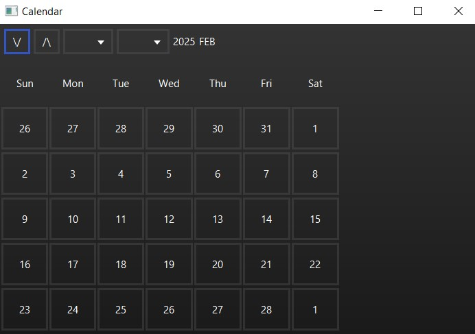
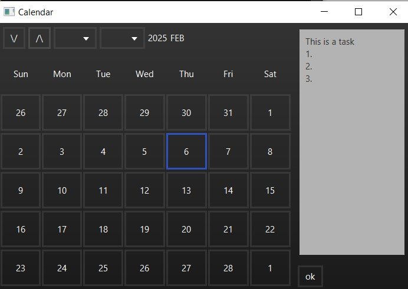
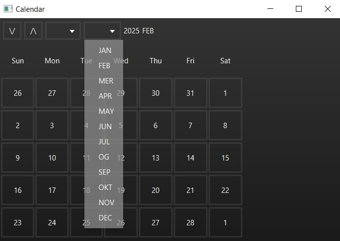
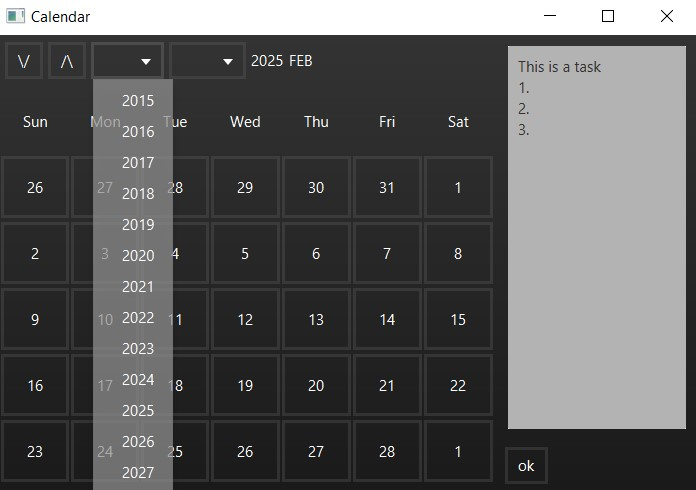

# JavaTasksCalendar  
## About  
A Calendar that you can write your tasks on. 

## Using:
- JavaFX & FXML
- css for styling  

## Project Structure  
- Task object : holds tasks per date
- CalendarController : controlls the GUI while using the Task object 
- Calendar : the main program 

## How to Run  
1. Simply complie and run (ive added a bat file to compile and a complied version)  

## How to use
- click the required date and a text filed will pop up, write your task down and click ok. 

## Notice
- i haven't yet added the option to save the task into a file, right now it only saves in run time.

## Pics
 

 

Enjoy! 😃  
